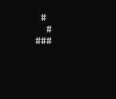

---

# Conway's game of life



## Building

### Prerequisites
- Visual Studio

### Building the Project
1. Clone the repository:
   ```bash
   git clone https://github.com/EyupOz1/Conway-s-Game-of-Life.git
   cd repository
   ```

2. Generate project files:
   ```bash
   .\tools\premake5.exe vs2022
   ```

3. Build the project:
   - Open the generated `.sln` file in ./bin and build the solution.

---
